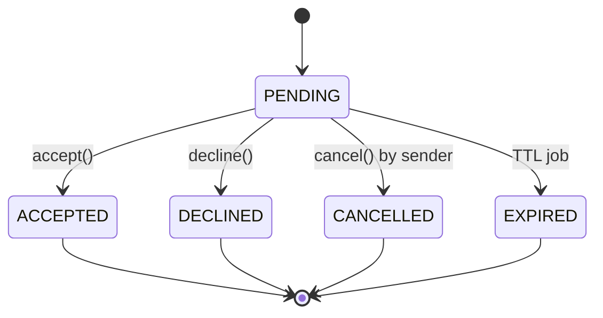
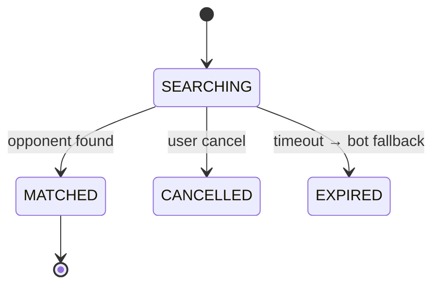
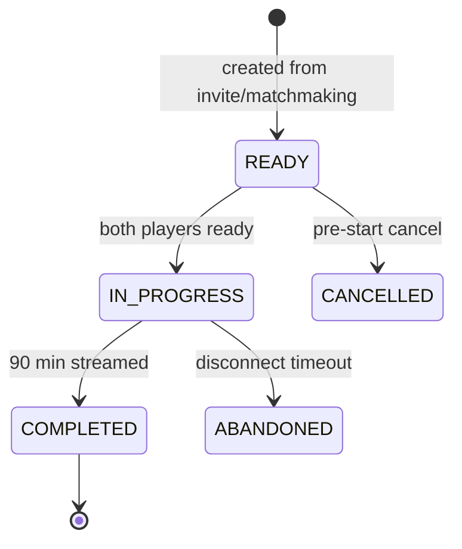
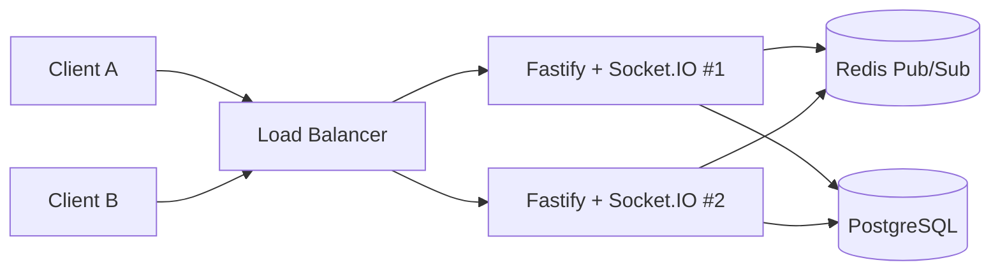
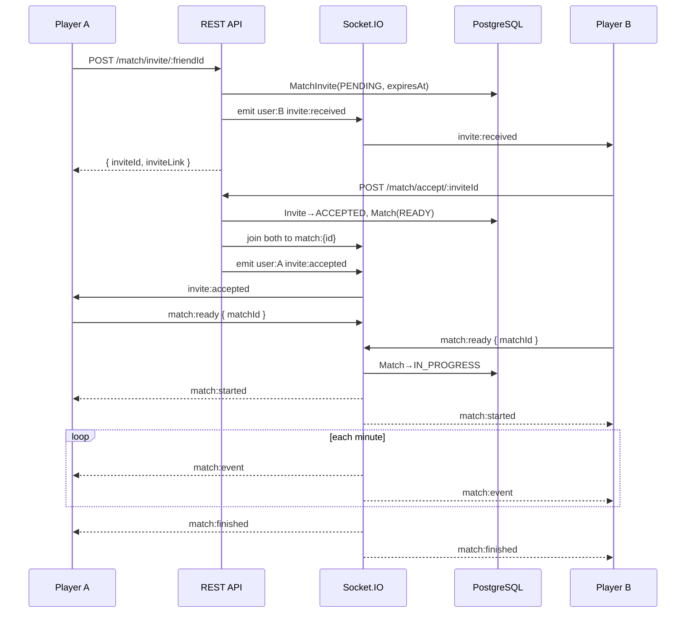
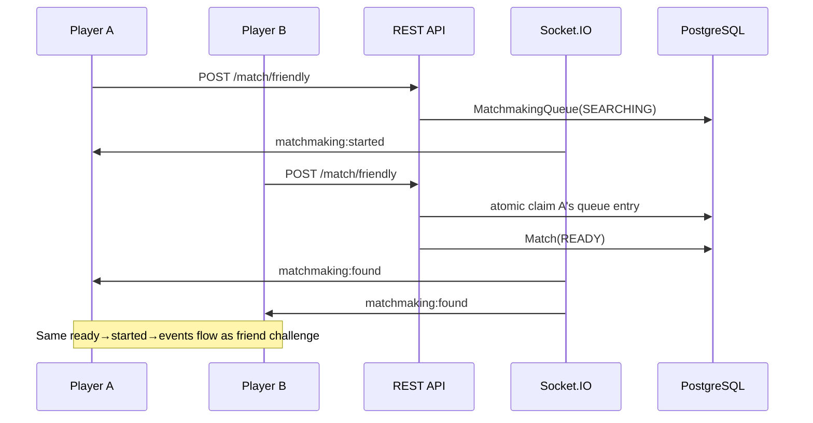
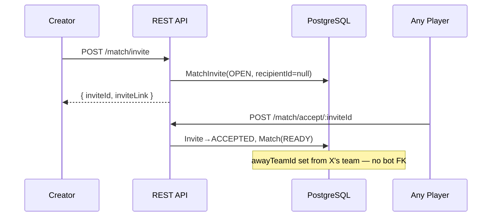

# Match & Multiplayer System Architecture

Production-grade redesign of the football manager match, invite, matchmaking, and realtime layers.

---

## 1. Audit: Current Problems (Before)

| Problem | Impact |
|---------|--------|
| `Match` used for invite + lobby + live + completed | God-object, 15+ conditional branches |
| `acceptMatch()` runs simulation synchronously | Initiator has zero visibility; poor UX |
| Open challenge uses `bot-system` placeholder team | FK pollution, cleanup hacks |
| No invite TTL / dedup | Spam invites, stale deep links |
| `IN_PROGRESS` never set | "Live tactics" re-simulates completed matches |
| Blocking 12s HTTP poll (`waitForOpponent`) | Thread exhaustion at scale |
| No WebSocket | Client `setInterval` + GET polling |
| `handleMatchCompletion` not exported | Season matches crash at runtime |

---

## 2. Entity-Relationship Diagram

```mermaid
erDiagram
    User ||--o{ MatchInvite : "sends"
    User ||--o{ MatchInvite : "receives"
    User ||--o{ MatchmakingQueue : "queues"
    User ||--o{ Match : "home/away"
    Team ||--o{ Match : "home/away"
    MatchInvite ||--o| Match : "creates"
    Match ||--o{ MatchEvent : "contains"

    User {
        uuid id PK
        string telegramId
        int points
    }

    MatchInvite {
        uuid id PK
        enum type "FRIEND|OPEN"
        enum status "PENDING|ACCEPTED|DECLINED|CANCELLED|EXPIRED"
        uuid senderId FK
        uuid recipientId FK "nullable for OPEN"
        uuid senderTeamId
        datetime expiresAt
    }

    MatchmakingQueue {
        uuid id PK
        uuid userId FK
        uuid teamId
        int pointsSnapshot
        enum status "SEARCHING|MATCHED|CANCELLED|EXPIRED"
        uuid matchId FK "nullable"
        datetime expiresAt
    }

    Match {
        uuid id PK
        enum type "FRIENDLY|CHALLENGE|SEASON|EVENT"
        enum status "READY|IN_PROGRESS|COMPLETED|CANCELLED|ABANDONED"
        uuid inviteId FK "nullable"
        bool isBot
        int currentMinute
        bool homeReady awayReady
    }
```

### Responsibility Split

| Entity | Responsibility |
|--------|----------------|
| **MatchInvite** | Pre-match negotiation (friend + open challenge) |
| **MatchmakingQueue** | Friendly auto-match search |
| **Match** | Actual game instance with lifecycle |
| **MatchEvent** | In-game events (goals, cards, subs) |

---

## 3. State Machines

### MatchInvite



### MatchmakingQueue



### Match



---

## 4. WebSocket Architecture

### Why Socket.IO over @fastify/websocket

| Criterion | Socket.IO | Fastify WebSocket |
|-----------|-----------|-------------------|
| Rooms (`user:{id}`, `match:{id}`) | Built-in | Manual map |
| Horizontal scale | `@socket.io/redis-adapter` | Custom Redis pub/sub |
| Reconnect + state recovery | Native (v4.6+) | Manual |
| Event model | `{ event, payload }` | Raw frames |
| Fallback transport | Long-polling | None |
| Ecosystem | Battle-tested at 100k+ CCU | Lower-level |

**Decision: Socket.IO** attached to Fastify's underlying `app.server` HTTP server.

### Topology (Multi-Instance)



### Rooms

| Room | Join trigger | Purpose |
|------|--------------|---------|
| `user:{userId}` | On connect (JWT) | Invites, matchmaking, personal notifications |
| `match:{matchId}` | On accept / match found / reconnect | Live match events |

### Auth

```
Handshake:
  auth: { token: "<JWT>" }
  OR
  headers: { Authorization: "Bearer <JWT>" }
```

Middleware: `src/ws/socket.auth.middleware.ts` — verifies JWT, attaches `socket.data.user`.

### Reconnect

1. Socket.IO `connectionStateRecovery` (2 min window)
2. On connect: query active `Match` (READY/IN_PROGRESS) → rejoin `match:{id}`
3. Re-emit pending invites to recipient
4. Broadcast `PLAYER_RECONNECTED` to match room

---

## 5. WebSocket Events (Full List)

### Server → Client

| Event | Payload | When |
|-------|---------|------|
| `connected` | `{ userId }` | After auth |
| `invite:received` | `{ inviteId, type, sender, expiresAt, inviteLink? }` | Friend/open invite |
| `invite:accepted` | `{ inviteId, matchId, acceptedBy }` | Recipient accepts |
| `invite:declined` | `{ inviteId, declinedBy }` | Recipient declines |
| `invite:expired` | `{ inviteId }` | TTL expired |
| `invite:cancelled` | `{ inviteId }` | Sender cancels |
| `matchmaking:started` | `{ queueId, expiresAt }` | Queue entered |
| `matchmaking:found` | `{ matchId, opponent, isBot }` | Opponent matched |
| `matchmaking:cancelled` | `{ queueId }` | User cancelled search |
| `matchmaking:expired` | `{ queueId }` | Timeout before bot |
| `match:ready` | `{ matchId, homeReady?, awayReady? }` | Match room / player ready |
| `match:started` | `{ matchId, seed, homeUserId, awayUserId }` | Both ready |
| `match:event` | `{ matchId, minute, type, team, ... }` | Live event stream |
| `match:tactics_updated` | `{ matchId, team, pressingType, minute }` | Tactics change |
| `match:finished` | `{ matchId, homeScore, awayScore, winner, rewards }` | Match complete |
| `match:player_disconnected` | `{ matchId, userId }` | Opponent offline |
| `match:player_reconnected` | `{ matchId, userId? }` | Player back |
| `error` | `{ message }` | Handler error |
| `pong` | `{ ts }` | Ping response |

### Client → Server

| Event | Payload | Action |
|-------|---------|--------|
| `match:ready` | `{ matchId }` | Mark player ready |
| `match:tactics` | `{ matchId, pressingType?, substitutions? }` | Live tactics |
| `matchmaking:start` | `{}` | Start search (prefer REST) |
| `matchmaking:cancel` | `{}` | Cancel search |
| `ping` | `{}` | Keepalive |

---

## 6. Sequence Diagrams

### Friend Challenge



### Friendly Matchmaking



### Open Challenge (no bot placeholder)



---

## 7. API Changes

| Method | Route | Change |
|--------|-------|--------|
| POST | `/match/friendly` | Returns `{ queueId }` or `{ matchId }` — no blocking poll |
| POST | `/match/invite/:friendId` | Returns `{ inviteId }` not `{ matchId }` |
| POST | `/match/invite` | Open challenge → `{ inviteId }` |
| POST | `/match/accept/:inviteId` | Creates Match(READY), WS events |
| POST | `/match/invite/:inviteId/decline` | **New** |
| POST | `/match/invite/:inviteId/cancel` | **New** |
| GET | `/match/invites/pending` | **New** |
| GET | `/match/:matchId` | Read-only snapshot (no polling needed) |

---

## 8. Migration Plan

### Phase 1 — Schema (zero downtime prep)

1. Deploy new Prisma schema (adds tables/enums, alters MatchStatus)
2. Run SQL enum migration:

```sql
-- Add new enum values before removing old ones
ALTER TYPE "MatchStatus" ADD VALUE IF NOT EXISTS 'READY';
ALTER TYPE "MatchStatus" ADD VALUE IF NOT EXISTS 'ABANDONED';
```

3. Create `MatchInvite`, `MatchmakingQueue` tables

### Phase 2 — Dual-write (optional, 1 week)

- New invites → `MatchInvite`
- Legacy deep links `challenge_{matchId}` → redirect handler checks both tables

### Phase 3 — Data migration

```bash
npx ts-node scripts/migrate-match-system.ts
```

Converts legacy `Match(PENDING)` → `MatchInvite`, deletes orphan bot placeholder FKs.

### Phase 4 — Client cutover

- Connect Socket.IO on login
- Replace `setInterval GET /match/:id` with event listeners
- Update deep links: `invite_{inviteId}`

### Phase 5 — Cleanup

- Remove `waitForOpponent` blocking loop (already removed)
- Drop legacy `PENDING` from MatchStatus enum after verification

---

## 9. Environment Variables

```env
DATABASE_URL=postgresql://...
JWT_SECRET=...
REDIS_URL=redis://localhost:6379   # Required for multi-instance WS
CORS_ORIGIN=https://your-app.com
TELEGRAM_BOT_USERNAME=goalchaintest_bot
```

---

## 10. File Map

```
src/
  ws/
    types.ts                    # Event enums + payloads
    socket.emitter.ts           # Room helpers + cross-service emit
    socket.auth.middleware.ts   # JWT handshake
    socket.connection.handler.ts
  plugins/
    socket.plugin.ts            # Socket.IO + Redis adapter
  modules/match/
    match-invite.service.ts     # Invite CRUD + dedup + expiry
    matchmaking.service.ts      # Queue + atomic match
    match-live.service.ts       # READY→IN_PROGRESS→stream→COMPLETED
    match-completion.service.ts # Rewards, tasks, ratings
    match-team.service.ts       # Team loading for simulator
    match.service.ts            # Bot match, history, getById
scripts/
  migrate-match-system.ts
```

---

## 11. Scaling Checklist (10k+ CCU)

- [ ] Redis for Socket.IO adapter (mandatory multi-instance)
- [ ] Sticky sessions on LB OR Redis adapter (prefer Redis)
- [ ] Match event streaming via room broadcast (not DB poll)
- [ ] `MatchmakingQueue` indexed on `(status, pointsSnapshot)`
- [ ] Invite expiry cron every 60s (not per-request)
- [ ] Separate match runners to worker process at 50k+ (future: BullMQ)
- [ ] Connection limits per IP at LB
- [ ] JWT short TTL + refresh for WS reconnect
